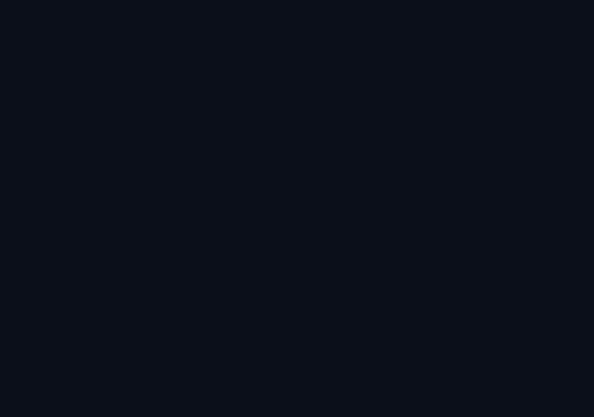
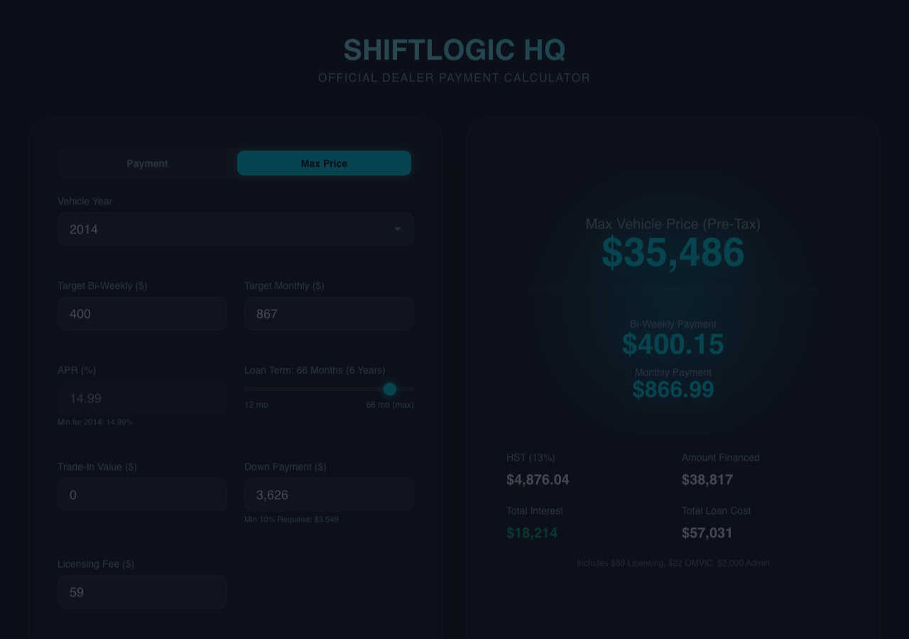

# ShiftLogic HQ — Auto Loan Calculator

A dual-mode Ontario auto loan payment calculator built with React, TypeScript, and Vite. Computes bi-weekly and monthly payments using Ontario-specific taxes and lender rules, with a reverse mode that works backward from a target payment to the maximum affordable vehicle price.

**[Live Demo](https://auto-loan-calculator.pages.dev)**

## Modes

### Payment Mode (Forward)
Enter a vehicle price and loan details to calculate bi-weekly and monthly payments, HST, total interest, and a full amortization schedule.

### Max Price Mode (Reverse)
Enter a target bi-weekly or monthly payment to find the maximum vehicle price you can afford pre-tax. Changing the vehicle year automatically adjusts the APR, term, and down payment minimum to match Ontario lender rules.

## Screenshots

### Payment Mode


### Max Price Mode


## Ontario Lending Rules

Vehicle year determines the maximum loan term and minimum APR:

| Vehicle Year | Max Term | Min APR | Min Down Payment | Bank Financeable |
|---|---|---|---|---|
| 2023+ | 84 months (7 yr) | 6.99% | None | Yes |
| 2021–2022 | 72 months (6 yr) | 7.99% | None | Yes |
| 2016–2020 | 60 months (5 yr) | 8.99% | None | Yes |
| 2010–2015 | 66 months (5.5 yr) | 14.99% | 10% of vehicle price | Yes |
| Pre-2010 | 48 months (4 yr) | 19.99% | 25% of vehicle price | No |

## Fees & Taxes (Ontario)

- **HST:** 13% on (vehicle price − trade-in + admin fee + OMVIC fee)
- **Admin Fee:** $2,000
- **OMVIC Fee:** $22
- **Licensing Fee:** $59 (default, editable)

Trade-in value is applied pre-tax and reduces the taxable amount.

## Features

- **Segmented pill toggle** switches between Payment and Max Price modes
- **Bi-weekly amortization schedule** with period-by-period principal, interest, and balance
- **Year change notifications** showing auto-adjusted APR, term, and down payment
- **Dynamic down payment floor** — minimum dollar and percentage displayed, enforced with validation
- **Thousand separators** on dollar inputs for readability
- **Linked target payment inputs** — changing bi-weekly auto-calculates monthly and vice versa
- **Editable loan term slider** in both modes (12-month steps, capped at year-rule maximum)
- **URL state persistence** — shareable links that restore all inputs including mode and target payments

## Tech Stack

- **React 19** with `useReducer` for state management
- **TypeScript 6** with strict linting
- **Vite 8** for dev server and production builds
- **Vitest** for unit testing (22 tests)
- **Cloudflare Pages** for deployment

## Development

```bash
npm install        # Install dependencies
npm run dev        # Start dev server (localhost:5173)
npm test           # Run tests (vitest)
npm run build      # Type-check and production build
```

## URL Parameters

All inputs sync to the URL for bookmarking and sharing:

```
?mode=reverse&year=2024&price=45000&trade=0&down=5000&apr=6.99&term=84&licensing=59&targetBiWeekly=500&targetMonthly=1083
```

Omitting `mode` (or setting it to anything other than `reverse`) defaults to Payment mode.

## How the Reverse Calculation Works

The reverse calculator solves the standard loan payment formula for principal and works backward through Ontario taxes and fees:

1. **Loan principal** from target payment: `L = P × ((1+r)ⁿ − 1) / (r(1+r)ⁿ)`
2. **Taxable amount:** `(L + downPayment − licensingFee) / 1.13`
3. **Max vehicle price:** `taxableAmount + tradeInValue − adminFee − omvicFee`

When a minimum down payment percentage applies (2010–2015: 10%, pre-2010: 25%), a circular dependency arises — the down payment floor depends on the vehicle price, but the vehicle price is the output. This is resolved algebraically:

`V = (L − licensingFee + (tradeIn − adminFee − omvicFee) × 1.13) / (1.13 − minDownPct)`

## License

MIT
